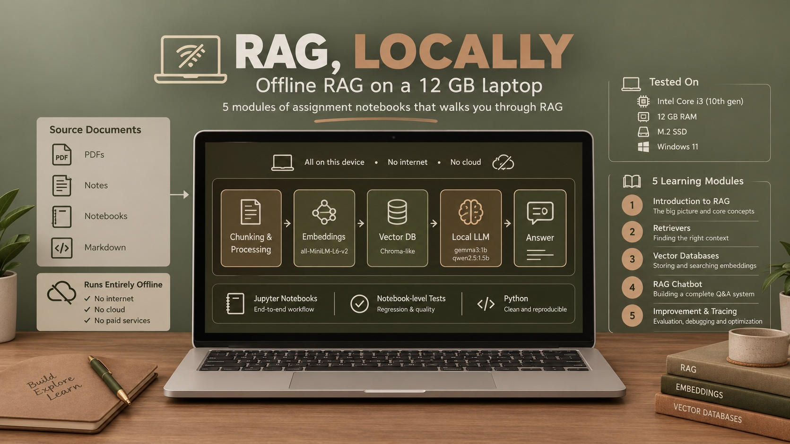
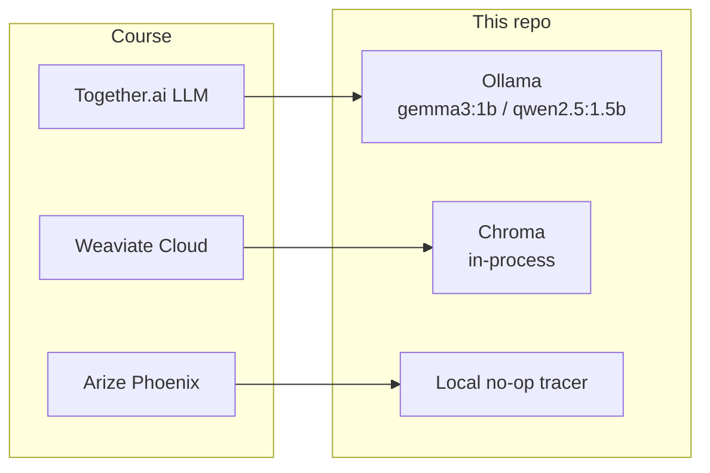

# rag-dlai-local



DeepLearning.AI's RAG course assignments, rewritten to run fully offline on a low-resource laptop.

[](https://github.com/Farahani1/rag-dlai-local/actions/workflows/tests.yml)

The course's five assignments assume a hosted LLM, a cloud vector database and a hosted tracing service. This repository replaces all three with local tools and runs every week on a 10th-gen Intel Core i3 with 12 GB RAM. It also tests the notebooks automatically and measures what changes when the model is small enough to run there.

On the course's Week 5 chatbot, a 1.5B model (`qwen2.5:1.5b`) answers 4 of 12 benchmark questions correctly. Most failures come from one step: the model routes FAQ questions to the product search. Replacing that one LLM call with an embedding lookup doubles the score and cuts the median answer time from 161 s to 36 s; FAQ answers get fast, product questions stay slow ([results](docs/results.md)):

| W5 pipeline, `qwen2.5:1.5b`, CPU only | Correct | Routed correctly | Median latency |
| --- | --- | --- | --- |
| As in the course | 4 / 12 | 15 / 30 | 161 s |
| Embedding router instead of the routing LLM call | 8 / 12 | 10 / 10 | 36 s |



## Quick start

Linux / macOS:

```bash
git clone https://github.com/Farahani1/rag-dlai-local.git && cd rag-dlai-local
python3 -m venv .env && source .env/bin/activate
pip install -r requirements.txt && cp config_example.yaml config.yaml
ollama pull gemma3:1b                                # Ollama: https://ollama.com/download
jupyter notebook                                     # open w1/C1M1_Assignment.ipynb
```

Windows (PowerShell):

```powershell
git clone https://github.com/Farahani1/rag-dlai-local.git; cd rag-dlai-local
python -m venv .env; .env\Scripts\Activate.ps1
pip install -r requirements.txt; Copy-Item config_example.yaml config.yaml
ollama pull gemma3:1b                                # Ollama: https://ollama.com/download
jupyter notebook                                     # open w1\C1M1_Assignment.ipynb
```

Python 3.12 or newer. If PowerShell refuses to run `Activate.ps1`, see [docs/setup.md](docs/setup.md#2-install-python-dependencies). Weeks 4–5 need their vector stores built once; see [docs/setup.md](docs/setup.md).

## Documentation

| Page | For |
| --- | --- |
| [Setup](docs/setup.md) | Full install on Windows and Linux/macOS, config, populating Chroma, troubleshooting |
| [Testing](docs/testing.md) | How the notebooks are tested without manual runs; test tiers; CI |
| [Results](docs/results.md) | Benchmark of the W5 pipeline on a small local model: accuracy, before/after fixes, where the time goes, one traced failure |
| [Design decisions](docs/decisions.md) | Why Chroma, why `.py` mirrors, why the weeks stay separate |
| [Data and licensing](docs/data.md) | Dataset sources, authors, licenses, what the MIT license covers |

## What's in this repo, week by week

Each week lives in its own `wN/` directory with its own `utils.py` (and, from W3 onward, its own `chroma_store.py`, `embedding.py`, etc.) — every week is adapted independently, so nothing you change in one week's directory affects another week.

| Week | Notebook | Original course topic | What had to be replaced locally |
|------|----------|------------------------|----------------------------------|
| **W1** | `w1/C1M1_Assignment.ipynb` | Introduction to RAG Systems | Together.ai LLM calls → Ollama; embedding + cosine-similarity retrieval stays local |
| **W2** | `w2/C1M2_Assignment.ipynb` | Implementing Retriever Functions in a RAG System | Together.ai LLM calls → Ollama; BM25 / embedding / hybrid retrieval implemented locally |
| **W3** | `w3/C1M3_Assignment.ipynb` | Building RAG Systems with a Vector Database | Weaviate Cloud → local Chroma (`w3/chroma_store.py`); metadata filtering, semantic/BM25/hybrid search, and reranking reimplemented against Chroma; Together.ai → Ollama |
| **W4** | `w4/C1M4_Assignment.ipynb` | Developing a RAG-based Chatbot | Weaviate → Chroma product catalog; Together.ai chat completions → Ollama; a small clothing-product dataset is embedded and stored locally for the chatbot to query |
| **W5** | `w5/C1M5_Assignment.ipynb` | Improving a RAG System | Builds on W4's chatbot with a token-usage/performance layer (`simplified` mode for every RAG step) and Arize-Phoenix-style tracing, replaced with local no-op tracing stand-ins; adds a local FAQ Chroma collection alongside the product one |

The course's original, unmodified notebooks are not redistributed here. If you are enrolled in the course, you can download them from the course platform and diff them against the adapted `C1M*_Assignment.ipynb` to see exactly what changed.

## Why this exists

Hi! If you're here, you probably want to learn RAG (Retrieval-Augmented Generation), specially using the excellent material from deeplearning.ai, but you might, like me, have had trouble accessing the original hosted materials (Weaviate Cloud, Together.ai, Arize Phoenix, ...). This project rewrites the backend code of each week's assignment so the notebooks can be run **completely offline on a low-resource laptop**, while preserving the content, structure, and interface of the original notebooks as closely as possible.

- **Runs 100% locally on low‑resource hardware** – all LLM calls and embedding generation happen on your machine using [Ollama](https://ollama.com). I tested it on a very basic laptop (10th‑gen i3, 12 GB RAM, M.2 SSD, Windows 11)

- **No payment or registration required** – all the resources are free

- **Respects the original course** – the core learning flow is preserved, so it would be in the deeplearning.ai way.

| SPECS | |
| ----- | ----- |
| CPU | 10th-gen Intel Core i3 |
| RAM | 12 GB |
| Storage | M.2 SSD |
| OS | Windows 11 |
| Generative model (Ollama) | `gemma3:1b` (W1–W4), `qwen2.5:1.5b` (W5) |
| Embedding model | `all-MiniLM-L6-v2` |

## Project conventions (for anyone extending this further)

These are the ground rules this adaptation follows:

- Every path used by any assignment module is declared in `config.yaml` and resolved through `setting.py` — no hardcoded paths inside `wN/` modules.
- No code path makes an online API call, or downloads data/models at runtime — everything needed must already be local.
- All data (raw CSVs, joblib caches, Chroma DB folders) lives under `data/` at the project root, shared across weeks where it makes sense (e.g. W4's and W5's product collections live in the same Chroma path, under different collection names) and otherwise namespaced per week.
- The course's original notebooks are not redistributed, but each `.py` mirror keeps the original cloud-based code path (`adapted=False`) next to the local one (`adapted=True`), so every change stays inspectable.
- Educational behavior (the exercises, their structure, and their intended learning outcome) is preserved, apart from a few small, deliberate deviations needed to run everything locally.

## Known limitations

- Small local models (1–1.5B parameters) are noticeably less reliable at structured-output tasks (e.g. W5's JSON filter generation) than the large cloud models the course was originally designed around. Where this happens, the notebook's own fallback logic (e.g. falling back to unfiltered semantic search when JSON parsing fails) is exercised for real rather than being purely theoretical — this is expected behavior with a small local model, not a bug.
- `w3/retrieval.py`'s / `w5/retrieval.py`'s reranking helpers are carried over from the original course code but are not exercised by every notebook path.
- Vector DB population scripts (`w4/populate_products.py`, `w5/populate_products.py`, `w5/populate_faq.py`) must be run manually once per environment (see [setup](docs/setup.md#5-populate-the-local-vector-databases-w4w5)); they are intentionally not run automatically by anything (tests, notebook startup) to keep test runs fast and side-effect-free.

## Data and copyright

The datasets under `data/` are credited to their authors, with licenses, in [docs/data.md](docs/data.md). This is an unofficial adaptation, not affiliated with DeepLearning.AI; the MIT license covers the adaptation code only, not course material or third-party data.

## Thanks

deeplearning.ai, for creating such a thoughtful RAG course :)

The Ollama team, for making local LLMs so easy.

The Chroma team, for a vector DB that just works locally with no server to stand up.

All the open-source model creators who made small, capable models that can run on my i3 computer :))
